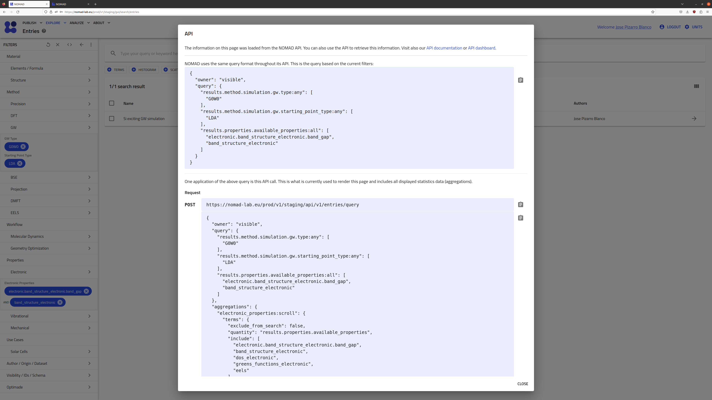

# Part I: How to explore the NOMAD Archive and Repository.

This part contains the information on how to explore the NOMAD Archive and Repository (in short, NOMAD-lab) in order to find electronic-structure calculations data. A more general tutorial can be found in the [FAIRmat tutorial 1](https://www.fairmat-nfdi.eu/events/fairmat-tutorial-1/tutorial-1-home) and the materials therein.

## Exploring NOMAD

Go to the [NOMAD-lab website](https://nomad-lab.eu/nomad-lab/). 

There are two main versions when exploring NOMAD-lab: the stable version (by clicking the "Open NOMAD" button) and the Beta or staging version. As the current NOMAD infrastructure is constantly being updated, we recommend you to go to the [Beta version](https://nomad-lab.eu/prod/v1/staging/gui/search/entries). The link can be also found when scrolling down in the main landing page of NOMAD-lab or when clicking on the top menu "Solutions > NOMAD" and scrolling down.

    
    

The landing NOMAD Entries page is a very intuitive and easy-to-use Graphical User Interface (GUI). Here we can explore data according to our preferences by clicking on the filter menus on the left. We can then select a variety of quantities that characterize the Material or system under study, the methodology parameters followed in the calculation or experiment, and the output properties. 

    

    

As you can see, there is a large variety of options to filter data in NOMAD. In this tutorial, we will focus on electronic-structure calculations, i.e., data obtained when solving Density Functional Theory (`DFT`), `GW` approximation, Bethe-Salpeter equation (`BSE`), projected tight-binding models (`Projection`), and Dynamical Mean-Field Theory (`DMFT`), as well as in the Properties menu called "Electronic". All of these menus contain (meta)information important for these calculations, and we are aiming for users and experts on these fields to help us shaping them according to their preferences. If you feel some important quantity is missing, or maybe you want to extend to other electronic-structure techniques, please contact us!

## Going beyond the GUI: querying data and the NOMAD metainfo

Once you have decided searching for a set of materials with certain properties and derived from your prefered methodology, NOMAD gives you another tool to perform a query via Application Programming Interface (API) queries or calls. This can be found by clicking the symbol `<>` at the top of the filter menus. In [Part II](part2.md), we will show you how to use an API query to get GW data and work with it in a Jupyter Notebook for analysis and plotting of the DFT and GW band structure.

    

Another functionality we will explore more in detail later on is the fact that not all the defined metadata quantities are shown in the filter menus on the GUI, but instead we decided to select a few representative quantities with the help and feedback of experts in the field. Nevertheless, the full information of a given system, methodology, or property can be found under the Metainfo data section (see [Part II](part2.md)). NOMAD also has a web with all the definitions that you can find under the top-left menu "Analyze > The NOMAD Metainfo".

    

