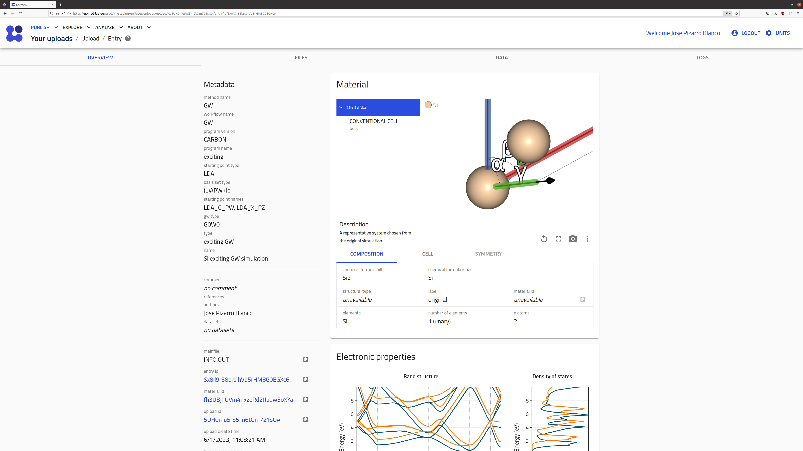
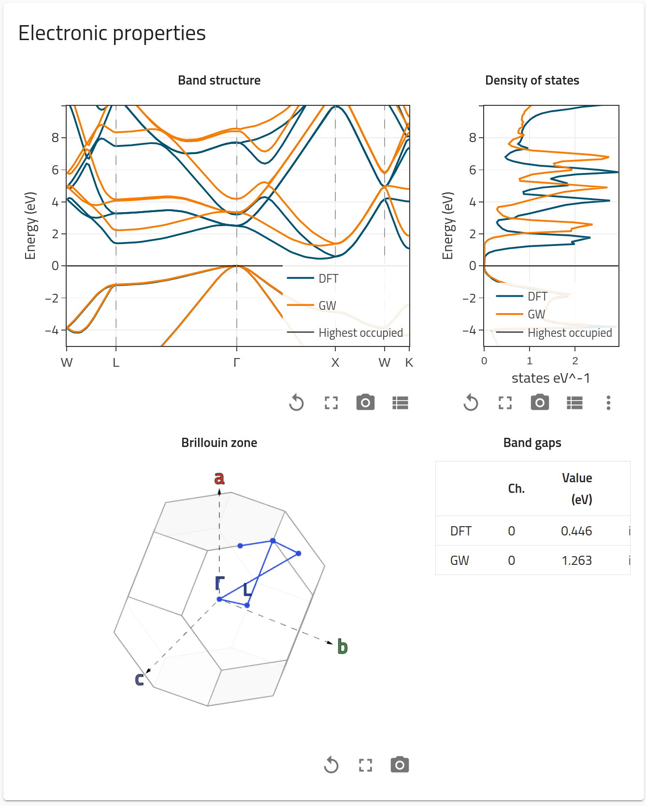
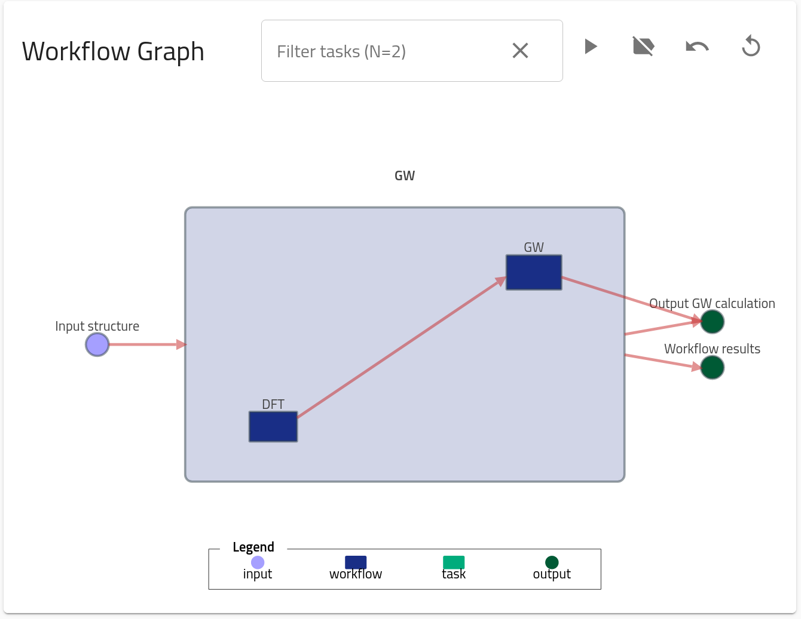

# Part II: How to make an upload and query NOMAD.

This part contains the information on how to make an upload with computational data in NOMAD, how to browse through the parsed metadata, and how to use API calls to query data in NOMAD for analysis. We will use the example files for a [DFT+GW calculation for Si2](https://github.com/FAIRmat-NFDI/AreaC-Tutorial10_2023/blob/main/docs/assets/part2_upload/GWexample_Si2.zip). Similar to the [Part I](part1.md), a more general tutorial can be found in the [FAIRmat tutorial 1](https://www.fairmat-nfdi.eu/events/fairmat-tutorial-1/tutorial-1-home) and the materials therein.

## Uploading computational data to NOMAD

Go to the [NOMAD Entries page](https://nomad-lab.eu/prod/v1/staging/gui/search/entries), and click on the top-left menu "Publish > Uploads". 

    

We can then click on "Create a new upload" button, or even try one of the examples in "Add example uploads". The page for creating a new upload allows us to upload, edit author metadata, and publish our data with an embargo. The system works with by dragging-and-dropping files compressed inside zip or tar file. In order for certain codes and features to be parsed, we recommend you trying your own files or visiting the top-left menu "About > About NOMAD". For this tutorial, we are going to use DFT and GW calculations done by the code [_exciting_](https://exciting-code.org/). 

    

## Browsing entries

As you can see in the GIF, after we drag-and-drop the zipped files a processing starts. NOMAD will try to find the corresponding parsers, and if succesful, new entries are generated. In this example we are uploading a DFT+GW calculation, for which we obtained three entries: `DFT SinglePoint`, `GW SinglePoint`, and `GW`. We recommend you to visit later the [Part V](part5.md), but for now is enough to know that we make a difference between the DFT part, the GW part, and then we combine both in what we called `GW workflow`. This last one is the one containing the combined metainformation of DFT and GW, and thus, it is the most general entry of all three.

We can browse each entry by clicking on right arrow `→`. We land in the Overview page of the entry, which contains basic information and visualizations for the entry.

    

Extra visualizations, such as the _Electronic properties_ or the _Workflow graph_ will appear depending on the character of the entry (for example, a Molecular Dynamics calculation will not contain _Electronic properties_ but rather _Thermodynamic properties_ and _Trajectories_ visualizations, see [FAIRmat tutorial 7](https://www.fairmat-nfdi.eu/events/fairmat-tutorial-7/tutorial-7-home)).

    
    

Lastly, besides Overview, we can also visit "Files", a list of all the files present in the entry folder, "Data", the populated metadata sections and quantities, and "Logs, a list of logging success, warnings and errors. In the "Data" menu, we can check which sections and quantities (as defined in "Analyze > The NOMAD Metainfo") has been populated.

    

<!--TODO: add Jupyter Notebook querying-->
