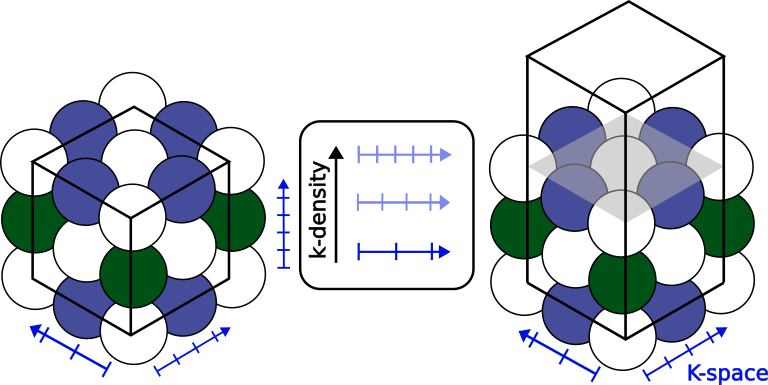
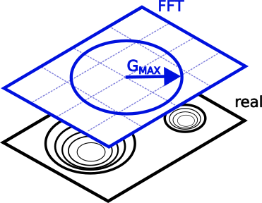
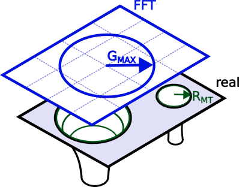

# Part III: Numerical precision in _ab initio_ calculations.

In this part, you will learn about several new quantities and tools for working with numerical-precision settings in NOMAD.
These tools will help you

1. query for the level of precision or conformity that you need.
2. deploy extracted data into a notebook to start performing data science.

Note that _precision_ specifies how close a calculation's convergence is with respect to the complete basis set limit, and not necessarily experiments (that would be _accuracy_).
As such, it only really makes sense when comparing entries of the same system.
It is best thought of as _a filter that gets applied after you have already chosen your material and method of interest_.

Since these precision quantities are new and by times community-specific, this tutorial places the emphasis on their definitions.
By times it also briefly touches on the bare minimum of theoretical knowledge required to handle them, but mostly leaves the interested reader with references to follow up on.
There are also a couple of example instructions guiding you to a specific entry or for downloading processed data into a notebook.
Lastly, watch out for the boxes with a pencil sign. They delve deeper into some topics and can be skipped at the first reading.

## Lay-out of the Precision section

To start, go to the Entries overview page > FILTERS (side menu) > Precision.
To navigate to the Entries page, check out [Part I - Exploring NOMAD](part1.md#entries_section).
The side menu in front of you is ordered so it starts out very general ([**k-line Density**](#k_section), [**Code-specific Tier**](#tier_section))
and below the choice of **Basis Set**, only contains quantities specific to certain basis set types, e.g. [**Plane-wave Cutoff**](#val_section), [**APW Cutoff**](#val_section).
The same quantities can be found for each entry in their OVERVIEW page > DATA > **results** > **method** > **simulation** > **precision**.
Following along with the example below, make sure your precision settings are sensible by filtering down to a well-defined system (cubic-centered Actinium) via FILTERS > Material > Ac > only compositions that ... > sorting by **Formula**.

    <label>
        <input type="checkbox">
        
    </label>

Some quantities are so specific and / or verbose, that they are relegated to DATA.
This means that they do not show up in the side menu, nor the search bar.
[Muffin-tin spheres](#mt_section) gives an example of when it is interesting to check them out and how to do so.

## Reciprocal space {#k_section}

In periodic systems, the most universal numerical parameter is the integration of the reciprocal space, or k-space, and its sampling.
With the sampling points often being spaced at fixed intervals, one can define a homogeneous _k-density_
$= \frac{\text{no. k-points}}{||\text{k-lattice vector}||}$.
As the k-density ramps up, the Bloch wavefunction converges. <!-- phrase better -->
Note that each dimension has its own k-density, which do not have to coincide.
To ensure that NOMAD users obtain data that meets their convergence needs, ***k-line density*** only shows the lowest value.

    

!!! note "Band structure calculations"
    For their spatial resolution, band structures sample along line paths connecting several high-symmetry points instead of the reciprocal lattice vectors.
    Not only can each line path can have its own spacing, their projections onto the reciprocal lattice vectors will vary.
    In short, they deviate from the fixed spacing requirement, and therefore, NOMAD filters them out.
    Conceptually, this is fine, since k-line density's aim is provide context to convergence, where this type of sampling does not apply.

## Electronic Structure {#elec_section}

At the level of the unit cell, there are several paradigms on how to represent the electronic wavefunction.
In this tutorial, we explore basis sets that start from plane waves, which mathematically mix well with the Bloch convolution.
In particular, we address _projector-augmented waves_ (PAW) and _augmented plane waves_ (APW).
As their names suggest, both extend the regular plane waves in regions where convergence is slow, namely around atomic nuclei.

A big distinction between PAW and APW is where they each draw this divide:

- PAW: the deciding factor is the orbital energies, with those below a certain threshold accounted for in special-purpose pseudopotentials.
  More on this in [Pseudopotentials](#pseudo_section).
- APW: here the divide is spatial in nature.
  A (mostly) spherical region, i.e. the muffin-tin sphere, is drawn surrounding the nuclei.
  The valence electrons reside in interstitial region between these spheres. 

### Valence Electrons {#val_section}

The main parameter controlling the plane waves is the longest k-vector $\mathbf{G}^{max}$.
A basis set of plane waves is then generated at fixed intervals, i.e. the secondary parameter, up to $\mathbf{G}^{max}$.
Since the sampling is symmetric in each direction, the length, $||\mathbf{G}^{max}||$, suffices.
By convention, most plane wave (especially PAW) codes express the vector length in energy units, which NOMAD reports as ***plane-wave cutoff***,
$E^{max}_{cut} = \frac{\left(\hbar ||\mathbf{G}_{cut}^{max}||\right)^2}{2m_e}$.

    

In principle, one can follow the same reasoning for the APW paradigm.
However, the cutoff energy alone gives an incomplete view.
While in PAW the plane waves sample the whole supercell, in APW they are barred from the muffin-tin spheres.
The convention here is to compare the length of $G^{max}$ to the largest muffin-tin radius in reciprocal space, yielding the unit-less fraction, ***APW cutoff***,
$2\pi \frac{||\mathbf{G}_{cut}^{max}||}{||\mathbf{G}_{MT}^{max}||} = ||\mathbf{R}_{MT}^{min}|| \cdot ||\mathbf{G}_{cut}^{max}||$.

    

NOMAD points out these differences by specifying the unit after the quantity name and between brackets.
For more detail, hover over the quantity name.

Both cutoff types can safely be increased to retrieve entries with progressively better converged valence electron wavefunctions.

!!! note "What about _grid spacing_?"
    At the moment, the mesh of the reciprocal or fast Fourier-transformed (FFT) space is not yet extracted.
    It is on the _planned feature_ list, though with low priority, considering that most of the convergence is already captured by the cutoff.
    If an upload or analysis ever requires a new feature, feel free to reach out to us via [fairmat@physik.hu-berlin.de](fairmat@physik.hu-berlin.de).

### Core Electrons

The mathematical parameters describing the electronic core region are extracted, but do not appear in the side menu. <!-- core-electron treatment still exists in DFT -->
To access them, select an entry, e.g. type `entry_id = zxhFQjN5Mny1FW5QEOGxWLPThF3r` in the search bar > OVERVIEW > DATA.
In the DATA browser follow **run** (all computational data) > **method** ( metadata describing the calculation setup) > **electrons_representation**.
This sections contains metadata on the mathematical description of the electronic structure.

    <label>
        <input type="checkbox">
        
    </label>

Each representation comes with a **scope** and a **type**, which specify the entity (e.g. wavefunction, density, exchange-correlation density, integration grid) and the overall basis set, respectively.
Hardly any code sticks to a single set of parameters values, instead adapting them according to task at hand.
For this reason there can be multiple electrons representations, each with their unique scope.
Those reported in the search are always the settings for `scope = wavefunction`.

As you have learned in [Electronic Structure](#elec_section), some basis sets divide the orbital set into widely different approaches.
Each **basis_set** subsection describes and individual region.
Here too, you will find **scope** and **type** with pretty much the same definitions.
Take note though, since the basis set **scope** refers to the region it encodes.
Examples include cases mentioned above, based on

- orbital energy: _core_ vs _valence_.
- spatial boundaries: _muffin-tin_ vs _interstitial_
- Hamiltonian: _kinetic_ and _electron-nucleus_ interaction vs _electron-electron_ interaction in the case of CP2k's Quickstep algorithm.

#### Muffin-tin spheres {#mt_section}

APW is an all-electron approach, meaning that all orbitals are relaxed during an electronic self-consistent (SCF) routine.
By itself, APW is no longer state-of-the-art and has been followed up by extensions such as LAPW, SLAPW, and APW+lo.
Throughout this tutorial, APW is used as a shorthand for this entire family of approaches and not just the progenitor.

While a full overview of the theory is beyond the scope of this tutorial, a quick rundown is necessary to explain the NOMAD design choices.
Within the muffin-tin sphere, APW distinguishes between core and valence states, which can be decoupled.[@gulansExcitingFullpotentialAllelectron2014]
The core states can then be solved via a standalone spherically symmetric Dirac equation.

Solutions $u\left(r,\epsilon\right)$ to the radial equation for the valence states, meanwhile, are defined in terms of the angular momentum $l$ and an energy parameter $\epsilon_{i\mathbf{k}}$, which can converge towards the orbital energy. <!-- mention splitting by radial and spherical? -->
Solving directly for $\epsilon_{i\mathbf{k}}$, which is the original APW formulation, however, yields a set of non-linear equations.
The common workaround is to restrict the index $i \approx n, l$ to just $l$ and treat $\epsilon_{l\mathbf{k}}$ as a constant in $u$, so the equations become linear again. [@gulansExcitingFullpotentialAllelectron2014] [@singhPlanewavesPseudopotentialsLAPW2006]
Consequentially, only a single main quantum number $n$ can be computed for each $l$-channel.
This is where the distinction with core electrons comes in handy.

The value of $\epsilon_{l\mathbf{k}}$ in $u\left(r,\epsilon_{l\mathbf{k}}\right)$ is only an initial approximation.
Further corrections are added as Taylor expansions of $u$ in terms of $\epsilon_{l\mathbf{k}}$.
A first-order expansion yields LAPW orbitals.
Another option is to add more basis functions with less complex boundary conditions, called _local orbitals_ (lo).
The latter offer a flexible way for complementing the basis set and are especially popular for describing semi-core states, i.e. core-level states (as determined by the $n$-restriction) that should really be treated as valence instead, as well as unoccupied states.

<!-- Figure showing the MT orbitals -->

While some APW require a manual setup for each orbital, e.g. Wien2k, others use a couple of "steering" parameters to generate the orbitals.
In NOMAD, we typically to keep parameters as concise as possible, though in this case this is not practical for two reasons:

1. There is no consensus on which steering parameters to use. Each code allows different levels of customization.
2. The energy parameters provided by the user should not be directly used in the SCF routines.
   Rather, the code will have some algorithm that optimizes the initial energy parameters based on the geometry.
   As such, any orbital degeneracy is lifted.

To capture the orbitals states completely, NOMAD instead "unrolls" the steering parameters down to individual radial valence orbitals, identified by their _type_ (e.g. APW, LAPW, lo), associated _harmonic index_ $l$, _derivative order_ of $u\left( r \right)$, and of course, the initial energy parameter guess.
The _sampling grid_ inside the muffin-tin region, as well as the _treatment of the core electrons_ are all specified at the basis set level. 

<!-- Figure showing the unrolling -->

#### Pseudopotentials {#pseudo_section}

With the exception of APW, most plane wave codes hide the core structure via an effective potential for the valence electrons.
Where most of these older pseudopotentials where constrained in their range of applications, those built for projector-augmented waves exhibit the highest degree of flexibility.

Where before NOMAD would simply indicate the usage of pseudopotentials, it now gives a more complete description, such as:
the _title_, the _density functional_ (or sometimes GW) used to generate the pseudopotential, _projector_ information, the recommended _minimum plane wave cutoff_ to be used for the valence electrons, and whether or not it is _norm-conserving_.
The latter is a useful (but more expensive) integration property and is a prerequisite for some methods. 
All of this metadata can be found under **run** > **method** > **electrons_representation** or **atom_parameters** (describes the calculation setup by elemental type).

!!! note "Why am I seeing double quantities?"
    The NOMAD metainfo is semantically constructed. Consequentially, a quantity may belong under several categories.
    In this case, they always share the same name and definition though.
    Meanwhile, some quantities (e.g. **pseudopotential** vs **pseudopotential_name**) may appear to be similar, but are not exactly identical.
    Likely, one of them is legacy (**pseudopotential_name**). The legacy quantity will then be deprecated, though their actual removal may be scheduled later for compatibility reasons.

!!! note "Disclaimer"
    At the moment, parsing is restricted to VASP pseudopotentials, including non-standard or self-made versions.
    Wider code-support is being built out.
    NOMAD takes great care in complying with the copyright of the standard POTCAR files and their distribution, so all instances are stripped down to their metadata alone.

## Code-specific tiers {#tier_section}

Filtering for the aforementioned quantities requires quite some expertise, and often it is hard to weigh the significance of two parameters to the electronic convergence.
Some codes, however, have benchmarked their own suggested settings into a list of increasing precision, i.e. _tiers_.
Lower tiers typically exist to facilitate better run speeds in long simulations or provide an initial starting point for higher tiers to start from and provide high-quality data.
The main purpose of these tiers, though, is to facilitate standardization and interoperability among code users.

To filter by tier, type `<code name> - <tier name>` (e.g. `VASP - accurate`) into the Entries overview page > NOMAD side menu > Precision > Code-specific Tier.
`<code name>` is integral to this combination, because tiers are code-specific and cannot be compared cross-code.
Lastly, note that `<tier name>` is case-sensitive, but suggestions will pop up once you start typing.

!!! note "Tier matching"
    Contrary to other Precision quantities like k-line density, plane-wave cutoff, or APW cutoff, tiers cannot be graded on a continuous scale.
    Since tiers represent points in a high-dimensional, there is no straightforward way to deviations from these standards.
    Therefore, NOMAD only assigns perfect matches.
    Even one altered parameter by the user, disqualifies it from the tier categorization (though the data will likely still be very valid and valuable).
